# Federated Learning MQTT Communication Flow

## High-Level Architecture

```
┌─────────────────────────────────────────────────────────────────────────────┐
│                           MQTT Broker (Mosquitto)                           │
│                                 Port 1883                                   │
└─────────────────────────────────────────────────────────────────────────────┘
         ▲                          ▲                          ▲
         │                          │                          │
         │ Pub/Sub                  │ Pub/Sub                  │ Pub/Sub
         │                          │                          │
    ┌────┴─────┐              ┌────┴─────┐              ┌────┴─────┐
    │  Server  │              │ Client 0 │              │ Client 1 │
    │          │              │          │              │          │
    │ Aggregate│              │  Train   │              │  Train   │
    │ & Send   │              │ & Send   │              │ & Send   │
    └──────────┘              └──────────┘              └──────────┘
```

## Detailed Communication Flow

```mermaid
sequenceDiagram
    participant S as FL Server
    participant B as MQTT Broker
    participant C0 as Client 0
    participant C1 as Client 1

    Note over S,C1: Phase 1: Connection & Registration
    
    S->>B: Connect to broker
    B-->>S: Connection ACK
    S->>B: Subscribe to topics:<br/>- fl/client_register<br/>- fl/client/+/update<br/>- fl/client/+/metrics
    
    C0->>B: Connect to broker
    B-->>C0: Connection ACK
    C0->>B: Subscribe to topics:<br/>- fl/global_model<br/>- fl/training_config<br/>- fl/start_training<br/>- fl/start_evaluation
    C0->>B: Publish to fl/client_register<br/>{client_id: 0}
    B->>S: Forward registration
    
    C1->>B: Connect to broker
    B-->>C1: Connection ACK
    C1->>B: Subscribe to topics:<br/>- fl/global_model<br/>- fl/training_config<br/>- fl/start_training<br/>- fl/start_evaluation
    C1->>B: Publish to fl/client_register<br/>{client_id: 1}
    B->>S: Forward registration
    
    Note over S: All clients registered!
    
    Note over S,C1: Phase 2: Training Configuration
    
    S->>B: Publish to fl/training_config<br/>{batch_size: 32, local_epochs: 20}
    B->>C0: Forward config
    B->>C1: Forward config
    
    Note over S,C1: Phase 3: Training Round (Repeated for each round)
    
    S->>B: Publish to fl/start_training<br/>{round: 1}
    B->>C0: Forward start signal
    B->>C1: Forward start signal
    
    Note over C0: Train on local data
    Note over C1: Train on local data
    
    C0->>B: Publish to fl/client/0/update<br/>{client_id: 0, round: 1,<br/>weights: [serialized],<br/>num_samples: 1000,<br/>metrics: {...}}
    B->>S: Forward update
    
    C1->>B: Publish to fl/client/1/update<br/>{client_id: 1, round: 1,<br/>weights: [serialized],<br/>num_samples: 1000,<br/>metrics: {...}}
    B->>S: Forward update
    
    Note over S: Aggregate models<br/>(FedAvg algorithm)
    
    Note over S,C1: Phase 4: Global Model Distribution
    
    S->>B: Publish to fl/global_model<br/>{round: 1,<br/>weights: [aggregated]}
    B->>C0: Forward global model
    B->>C1: Forward global model
    
    Note over C0: Update local model<br/>with global weights
    Note over C1: Update local model<br/>with global weights
    
    Note over S,C1: Phase 5: Evaluation
    
    S->>B: Publish to fl/start_evaluation<br/>{round: 1}
    B->>C0: Forward evaluation signal
    B->>C1: Forward evaluation signal
    
    Note over C0: Evaluate on test data
    Note over C1: Evaluate on test data
    
    C0->>B: Publish to fl/client/0/metrics<br/>{client_id: 0, round: 1,<br/>num_samples: 250,<br/>metrics: {loss, mse, mae, mape}}
    B->>S: Forward metrics
    
    C1->>B: Publish to fl/client/1/metrics<br/>{client_id: 1, round: 1,<br/>num_samples: 250,<br/>metrics: {loss, mse, mae, mape}}
    B->>S: Forward metrics
    
    Note over S: Aggregate metrics<br/>Store results
    
    Note over S,C1: Phase 6: Continue or Finish
    
    alt More rounds remaining
        Note over S: Round++
        S->>B: Publish to fl/start_training<br/>{round: 2}
        Note over S,C1: Repeat Phase 3-5
    else All rounds completed
        Note over S: Generate plots<br/>Save results
        Note over S,C1: Training Complete!
    end
```



## MQTT Topics Reference

### Server Publishes To:
| Topic | Payload | Purpose |
|-------|---------|---------|
| `fl/training_config` | `{batch_size, local_epochs}` | Send training hyperparameters |
| `fl/start_training` | `{round}` | Signal clients to start training |
| `fl/global_model` | `{round, weights}` | Send aggregated model weights |
| `fl/start_evaluation` | `{round}` | Signal clients to evaluate model |

### Server Subscribes To:
| Topic | Payload | Purpose |
|-------|---------|---------|
| `fl/client_register` | `{client_id}` | Receive client registrations |
| `fl/client/+/update` | `{client_id, round, weights, num_samples, metrics}` | Receive model updates |
| `fl/client/+/metrics` | `{client_id, round, num_samples, metrics}` | Receive evaluation metrics |

### Client Publishes To:
| Topic | Payload | Purpose |
|-------|---------|---------|
| `fl/client_register` | `{client_id}` | Register with server |
| `fl/client/{id}/update` | `{client_id, round, weights, num_samples, metrics}` | Send trained model weights |
| `fl/client/{id}/metrics` | `{client_id, round, num_samples, metrics}` | Send evaluation results |

### Client Subscribes To:
| Topic | Payload | Purpose |
|-------|---------|---------|
| `fl/training_config` | `{batch_size, local_epochs}` | Receive training config |
| `fl/start_training` | `{round}` | Receive training start signal |
| `fl/global_model` | `{round, weights}` | Receive aggregated model |
| `fl/start_evaluation` | `{round}` | Receive evaluation signal |

## State Machine Diagrams

### Server State Machine

```
┌─────────────┐
│  Startup    │
└──────┬──────┘
       │
       ▼
┌─────────────────────┐
│ Waiting for Clients │◄────────┐
│   (Registration)    │         │
└──────┬──────────────┘         │
       │ All clients            │
       │ registered             │
       ▼                        │
┌─────────────────────┐         │
│ Broadcast Training  │         │
│     Config          │         │
└──────┬──────────────┘         │
       │                        │
       ▼                        │
┌─────────────────────┐         │
│  Signal Start       │         │
│   Training          │         │
└──────┬──────────────┘         │
       │                        │
       ▼                        │
┌─────────────────────┐         │
│ Collect Client      │         │
│    Updates          │         │
└──────┬──────────────┘         │
       │ All updates            │
       │ received               │
       ▼                        │
┌─────────────────────┐         │
│ Aggregate Models    │         │
│    (FedAvg)         │         │
└──────┬──────────────┘         │
       │                        │
       ▼                        │
┌─────────────────────┐         │
│ Broadcast Global    │         │
│     Model           │         │
└──────┬──────────────┘         │
       │                        │
       ▼                        │
┌─────────────────────┐         │
│ Signal Start        │         │
│   Evaluation        │         │
└──────┬──────────────┘         │
       │                        │
       ▼                        │
┌─────────────────────┐         │
│ Collect Client      │         │
│    Metrics          │         │
└──────┬──────────────┘         │
       │ All metrics            │
       │ received               │
       ▼                        │
┌─────────────────────┐         │
│ Aggregate Metrics   │         │
│  & Store Results    │         │
└──────┬──────────────┘         │
       │                        │
       ▼                        │
    ┌──┴──┐                     │
    │More?│─── Yes ─────────────┘
    └──┬──┘
       │ No
       ▼
┌─────────────────────┐
│  Generate Plots     │
│   & Save Results    │
└──────┬──────────────┘
       │
       ▼
┌─────────────────────┐
│     Complete        │
└─────────────────────┘
```

### Client State Machine

```
┌─────────────┐
│  Startup    │
└──────┬──────┘
       │
       ▼
┌─────────────────────┐
│  Load & Partition   │
│      Data           │
└──────┬──────────────┘
       │
       ▼
┌─────────────────────┐
│  Create LSTM Model  │
└──────┬──────────────┘
       │
       ▼
┌─────────────────────┐
│ Connect to MQTT     │
│     Broker          │
└──────┬──────────────┘
       │
       ▼
┌─────────────────────┐
│ Send Registration   │
└──────┬──────────────┘
       │
       ▼
┌─────────────────────┐
│ Wait for Training   │◄─────────────────┐
│     Signal          │                  │
└──────┬──────────────┘                  │
       │ Receive                         │
       │ fl/start_training               │
       ▼                                 │
┌─────────────────────┐                  │
│ Train on Local Data │                  │
│  (Multiple Epochs)  │                  │
└──────┬──────────────┘                  │
       │                                 │
       ▼                                 │
┌─────────────────────┐                  │
│ Send Model Weights  │                  │
│   to fl/client/X/   │                  │
│      update         │                  │
└──────┬──────────────┘                  │
       │                                 │
       ▼                                 │
┌─────────────────────┐                  │
│ Wait for Global     │                  │
│     Model           │                  │
└──────┬──────────────┘                  │
       │ Receive                         │
       │ fl/global_model                 │
       ▼                                 │
┌─────────────────────┐                  │
│ Update Local Model  │                  │
│  with Global Weights│                  │
└──────┬──────────────┘                  │
       │                                 │
       ▼                                 │
┌─────────────────────┐                  │
│ Wait for Evaluation │                  │
│     Signal          │                  │
└──────┬──────────────┘                  │
       │ Receive                         │
       │ fl/start_evaluation             │
       ▼                                 │
┌─────────────────────┐                  │
│ Evaluate on Test    │                  │
│       Data          │                  │
└──────┬──────────────┘                  │
       │                                 │
       ▼                                 │
┌─────────────────────┐                  │
│ Send Metrics to     │                  │
│  fl/client/X/metrics│                  │
└──────┬──────────────┘                  │
       │                                 │
       ▼                                 │
    ┌──┴──┐                              │
    │More?│─── Yes ──────────────────────┘
    └──┬──┘
       │ No
       ▼
┌─────────────────────┐
│  Wait/Disconnect    │
└─────────────────────┘
```

## Data Flow for Model Weights

```
Round N:
┌──────────────┐
│  Client 0    │  Weights: W0 (NumPy arrays)
│              │    ↓
│  Train Model │  Serialize: pickle + base64
│              │    ↓
└──────┬───────┘  JSON: {"weights": "base64...", "num_samples": 1000}
       │            ↓
       │ MQTT     Publish to: fl/client/0/update
       │            ↓
       ▼         ┌─────────────────────┐
┌──────────────┐ │   MQTT Broker       │
│  Client 1    │ │                     │
│              │ │  Routes messages    │
│  Train Model │ │  based on topics    │
│              │ │                     │
└──────┬───────┘ └──────────┬──────────┘
       │                     │
       │ MQTT               │
       │                     │
       ▼                     ▼
   Publish to:        Received by:
   fl/client/1/update    Server
       
Server:
   ↓
Collect all client weights: [W0, W1]
   ↓
FedAvg Aggregation:
   W_global = (samples0 * W0 + samples1 * W1) / (samples0 + samples1)
   ↓
Serialize: pickle + base64
   ↓
JSON: {"round": N, "weights": "base64..."}
   ↓
Publish to: fl/global_model
   ↓
┌─────────────────────┐
│   MQTT Broker       │
│                     │
│  Broadcasts to all  │
│  subscribed clients │
└──────────┬──────────┘
           │
     ┌─────┴─────┐
     │           │
     ▼           ▼
┌─────────┐ ┌─────────┐
│Client 0 │ │Client 1 │
│         │ │         │
│Receive  │ │Receive  │
│Deserial.│ │Deserial.│
│Update   │ │Update   │
│Model    │ │Model    │
└─────────┘ └─────────┘
```

## Timing Diagram

```
Time │ Server          │ Client 0        │ Client 1        │ MQTT Broker
─────┼─────────────────┼─────────────────┼─────────────────┼──────────────
t0   │ Connect         │                 │                 │ ◄─ Connection
t1   │ Subscribe       │ Connect         │                 │ ◄─ Connection
t2   │                 │ Subscribe       │ Connect         │ ◄─ Connection
t3   │                 │ Register ───────┼─────────────────┤ ─► Forward
t4   │ ◄── Registration│                 │ Subscribe       │
t5   │                 │                 │ Register ───────┤ ─► Forward
t6   │ ◄── Registration│                 │                 │
t7   │ Send Config ────┼─────────────────┼─────────────────┤ ─► Broadcast
t8   │                 │ ◄── Config      │ ◄── Config      │
t9   │ Start Training ─┼─────────────────┼─────────────────┤ ─► Broadcast
t10  │                 │ ◄── Signal      │ ◄── Signal      │
t11  │                 │ [Training...]   │ [Training...]   │
t15  │                 │ Send Weights ───┤                 │ ─► Forward
t16  │ ◄── Weights     │                 │ Send Weights ───┤ ─► Forward
t17  │ ◄── Weights     │                 │                 │
t18  │ [Aggregate...]  │                 │                 │
t20  │ Send Global ────┼─────────────────┼─────────────────┤ ─► Broadcast
t21  │                 │ ◄── Global      │ ◄── Global      │
t22  │                 │ [Update Model]  │ [Update Model]  │
t23  │ Start Eval ─────┼─────────────────┼─────────────────┤ ─► Broadcast
t24  │                 │ ◄── Signal      │ ◄── Signal      │
t25  │                 │ [Evaluate...]   │ [Evaluate...]   │
t27  │                 │ Send Metrics ───┤                 │ ─► Forward
t28  │ ◄── Metrics     │                 │ Send Metrics ───┤ ─► Forward
t29  │ ◄── Metrics     │                 │                 │
t30  │ [Aggregate...]  │                 │                 │
t31  │ Next Round...   │                 │                 │
```

## Key Points

1. **Asynchronous Communication**: All communication is pub/sub via MQTT
2. **Topic-Based Routing**: Wildcards (+) allow server to receive from any client
3. **Serialization**: Model weights serialized with pickle + base64 for JSON compatibility
4. **FedAvg Algorithm**: Weighted average based on number of training samples
5. **Synchronous Rounds**: Server waits for all clients before aggregating
6. **Metrics Tracking**: Both training and evaluation metrics collected and aggregated
